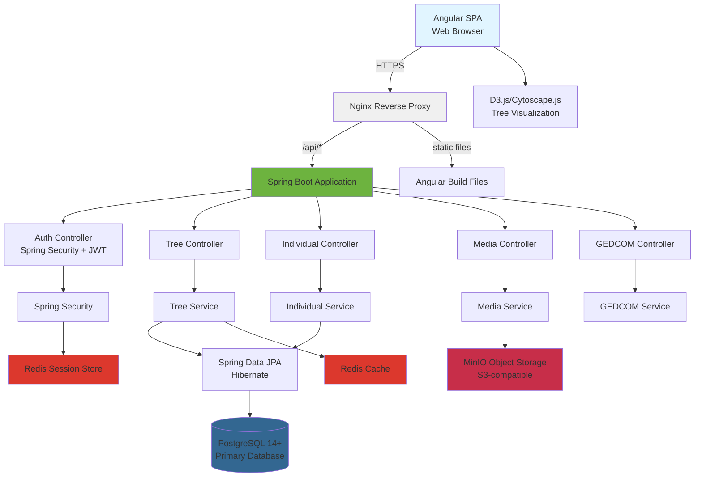
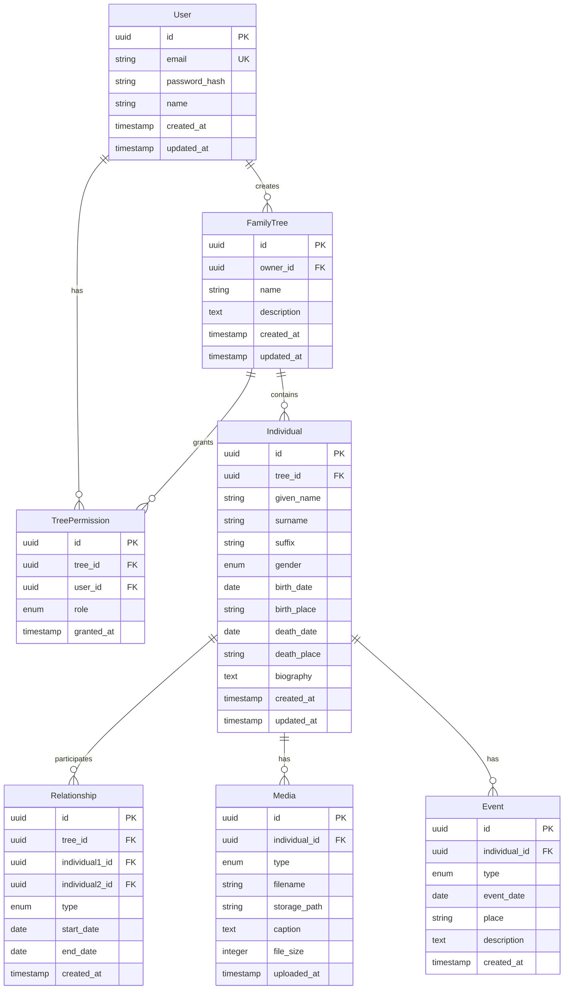
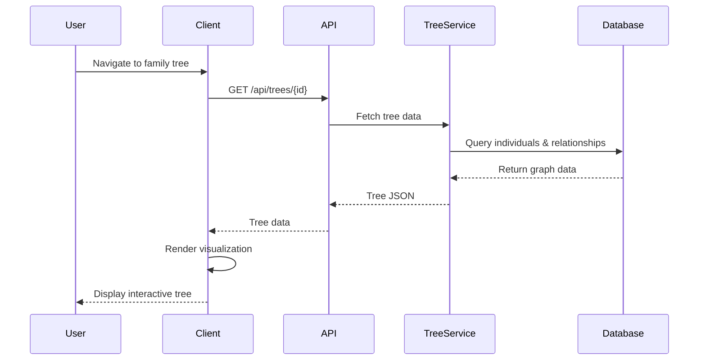

# System Design & Architecture

## Architecture Overview
**What is the high-level system structure?**



### Key Components
1. **Angular SPA**: Modern TypeScript-based single-page application for user interaction
2. **Nginx**: Reverse proxy serving Angular static files and proxying API requests to Spring Boot
3. **Spring Boot REST API**: RESTful API with comprehensive business logic layer
4. **Spring Security + JWT**: Stateless authentication and role-based authorization
5. **Spring Data JPA**: ORM layer with Hibernate for PostgreSQL data access
6. **Tree Service**: Core business logic for managing individuals, relationships, trees
7. **Media Service**: Handles photo/document uploads to MinIO, retrieval, thumbnails
8. **GEDCOM Service**: Parses and generates GEDCOM files using Java libraries
9. **PostgreSQL**: Primary relational database with recursive query support for graphs
10. **Redis**: Caching layer for tree data and session storage
11. **MinIO**: S3-compatible object storage for photos and documents
12. **D3.js/Cytoscape.js**: Client-side tree visualization in Angular

### Technology Stack

**Frontend:**
- Angular 17+ with TypeScript
- Angular Router for navigation
- D3.js or Cytoscape.js for tree visualization
- Angular Material or Tailwind CSS for styling
- RxJS for reactive programming
- NgRx or Service-based state management

**Backend:**
- Java 17+ (LTS)
- Spring Boot 3.x
  - Spring Web (REST API)
  - Spring Security (Authentication + JWT)
  - Spring Data JPA (Hibernate ORM)
  - Spring Cache (Redis integration)
  - Spring Session (Redis-backed sessions)
- Maven for build management
- Lombok for reducing boilerplate
- MapStruct or ModelMapper for DTO mapping

**Database & Storage:**
- PostgreSQL 14+ for primary database
- Redis 7+ for caching and session storage
- MinIO for object storage (S3-compatible)

**Infrastructure:**
- Docker & Docker Compose for containerization
- Nginx as reverse proxy and static file server
- Maven for dependency management and build

### Rationale
- **Java Spring Boot**: Enterprise-grade framework, excellent for complex business logic, superior multi-threading for concurrent users, strong type safety
- **PostgreSQL**: Best-in-class support for recursive CTEs (essential for ancestor/descendant queries), JSON support for flexible data, better performance than MySQL for hierarchical data
- **MinIO**: S3-compatible object storage, self-hosted for data ownership, can migrate to AWS S3 seamlessly, cost-effective
- **Redis**: Critical for performance - caches frequently accessed trees, manages sessions, enables real-time features
- **Angular**: Structured framework ideal for large applications, excellent tooling, strong typing with TypeScript, enterprise-ready
- **Maven**: Industry-standard Java build tool, comprehensive dependency management
- **Nginx**: Production-ready reverse proxy, serves Angular static files, SSL termination, load balancing ready
- **D3.js/Cytoscape.js**: Proven libraries for complex graph visualization, work well with Angular

## Data Models
**What data do we need to manage?**

### Core Entities



### Key Relationships

**Relationship Types:**
- `spouse` / `partner`
- `parent-child` (directional: individual1 is parent of individual2)
- `sibling`
- `adopted-parent-child`
- `step-parent-child`

**Permissions:**
- `owner`: Full control, can delete tree, manage permissions
- `editor`: Can add/edit/delete individuals and relationships
- `viewer`: Read-only access

**Event Types:**
- `birth`, `death`, `marriage`, `divorce`, `christening`, `burial`, `immigration`, `military_service`, `education`, `occupation`, `residence`, `custom`

### Data Flow



## API Design
**How do components communicate?**

### REST API Endpoints

**Authentication:**
```
POST   /api/auth/register          - Register new user
POST   /api/auth/login             - Login
POST   /api/auth/logout            - Logout
GET    /api/auth/me                - Get current user
```

**Family Trees:**
```
GET    /api/trees                  - List user's trees
POST   /api/trees                  - Create new tree
GET    /api/trees/{id}             - Get tree details
PUT    /api/trees/{id}             - Update tree
DELETE /api/trees/{id}             - Delete tree
GET    /api/trees/{id}/individuals - Get all individuals in tree
```

**Individuals:**
```
POST   /api/trees/{id}/individuals     - Add individual
GET    /api/individuals/{id}           - Get individual details
PUT    /api/individuals/{id}           - Update individual
DELETE /api/individuals/{id}           - Delete individual
GET    /api/individuals/{id}/ancestors - Get ancestors
GET    /api/individuals/{id}/descendants - Get descendants
```

**Relationships:**
```
POST   /api/relationships              - Create relationship
GET    /api/relationships/{id}         - Get relationship
PUT    /api/relationships/{id}         - Update relationship
DELETE /api/relationships/{id}         - Delete relationship
```

**Media:**
```
POST   /api/individuals/{id}/media     - Upload media
GET    /api/media/{id}                 - Get media file
DELETE /api/media/{id}                 - Delete media
```

**Import/Export:**
```
POST   /api/trees/{id}/import          - Import GEDCOM (multipart/form-data)
GET    /api/trees/{id}/export          - Export as GEDCOM
```

**Search:**
```
GET    /api/trees/{id}/search?q={query} - Search individuals
```

**Permissions:**
```
GET    /api/trees/{id}/permissions     - List permissions
POST   /api/trees/{id}/permissions     - Grant permission
DELETE /api/permissions/{id}           - Revoke permission
```

### Request/Response Formats

**Example: Get Individual**
```json
GET /api/individuals/123e4567-e89b-12d3-a456-426614174000

Response 200:
{
  "id": "123e4567-e89b-12d3-a456-426614174000",
  "treeId": "987e6543-e89b-12d3-a456-426614174000",
  "givenName": "John",
  "surname": "Smith",
  "suffix": "Jr.",
  "gender": "male",
  "birthDate": "1950-03-15",
  "birthPlace": "New York, NY, USA",
  "deathDate": null,
  "deathPlace": null,
  "biography": "Lorem ipsum...",
  "relationships": [
    {
      "id": "rel-001",
      "type": "spouse",
      "relatedIndividualId": "456e7890-e89b-12d3-a456-426614174000",
      "relatedIndividual": {
        "id": "456e7890-e89b-12d3-a456-426614174000",
        "givenName": "Jane",
        "surname": "Doe"
      }
    }
  ],
  "media": [
    {
      "id": "media-001",
      "type": "photo",
      "filename": "john-wedding.jpg",
      "caption": "Wedding day",
      "url": "/api/media/media-001"
    }
  ],
  "createdAt": "2024-01-15T10:30:00Z",
  "updatedAt": "2024-01-20T14:45:00Z"
}
```

### Authentication/Authorization
- **JWT-based authentication**: Access token stored in HTTP-only cookie
- **Role-based access control**: Check tree permissions for every operation
- **Row-level security**: Users can only access trees they own or have been granted permission to

## Component Breakdown
**What are the major building blocks?**

### Frontend Components

**Pages:**
- `LoginPage` - Authentication
- `DashboardPage` - List of user's trees
- `TreeViewPage` - Main tree visualization
- `IndividualDetailPage` - Individual profile
- `SettingsPage` - User and tree settings

**Core Components:**
- `TreeVisualization` - D3.js/Cytoscape.js interactive tree
- `IndividualCard` - Display individual summary
- `IndividualForm` - Add/edit individual
- `RelationshipPicker` - Select and create relationships
- `MediaGallery` - Display photos and documents
- `MediaUploader` - Upload files
- `GedcomImporter` - GEDCOM import wizard
- `SearchBar` - Search functionality
- `PermissionsManager` - Manage collaborators

### Backend Services/Modules

**Core Services:**
- `AuthService` - User authentication, JWT generation
- `UserService` - User CRUD operations
- `TreeService` - Family tree business logic
- `IndividualService` - Individual CRUD, relationship management
- `MediaService` - File upload, storage, retrieval
- `GedcomService` - GEDCOM parsing and generation
- `SearchService` - Full-text search
- `PermissionService` - Authorization checks

**Utilities:**
- `ValidationMiddleware` - Input validation
- `AuthMiddleware` - JWT verification
- `ErrorHandler` - Centralized error handling
- `Logger` - Structured logging

### Database/Storage Layer
- **PostgreSQL**: Primary data store
- **Blob Storage**: Photos and documents (filesystem or S3)
- **Redis** (optional): Session caching, rate limiting

### Third-Party Integrations
- None for MVP (future: mapping APIs, DNA testing services)

## Design Decisions
**Why did we choose this approach?**

### Decision 1: PostgreSQL vs. Neo4j for Graph Data
**Choice**: PostgreSQL with recursive CTEs
**Rationale**:
- Lower operational complexity (one database vs. two)
- PostgreSQL recursive queries perform well for small-to-medium trees
- Can migrate to Neo4j if performance becomes an issue
- Easier for developers familiar with relational databases

**Trade-offs**:
- More complex queries compared to Neo4j's Cypher
- May need optimization for very large trees (>10k individuals)

### Decision 2: Monolithic Backend vs. Microservices
**Choice**: Monolithic Node.js application
**Rationale**:
- Simpler deployment and development for MVP
- Lower overhead for small team
- Can refactor to microservices later if needed

**Trade-offs**:
- Less flexibility to scale individual services
- Tighter coupling between components

### Decision 3: REST API vs. GraphQL
**Choice**: REST API
**Rationale**:
- Simpler for MVP
- Well-understood caching and HTTP semantics
- Adequate for tree data fetching patterns

**Trade-offs**:
- May require multiple requests for complex data fetching
- No client-side schema introspection

### Decision 4: Client-side Rendering vs. Server-side Rendering
**Choice**: Client-side (SPA)
**Rationale**:
- Better interactivity for tree visualization
- Simpler backend (API-only)
- Can add SSR later for SEO if needed

**Trade-offs**:
- Slower initial page load
- SEO challenges (mitigated by authenticated app)

### Decision 5: Local Filesystem vs. S3 for Media Storage
**Choice**: Abstracted storage interface (start with filesystem, easy to switch to S3)
**Rationale**:
- Filesystem is simpler for self-hosted deployments
- S3 is better for cloud deployments
- Use storage adapter pattern for flexibility

### Patterns and Principles
- **Repository pattern**: Abstract database access
- **Service layer**: Business logic separated from routes
- **Validation at API boundary**: Use schema validation (e.g., Zod)
- **Error handling**: Centralized error handler with custom error classes
- **RESTful design**: Resource-oriented URLs

## Non-Functional Requirements
**How should the system perform?**

### Performance Targets
- **API response time**: < 200ms for simple queries, < 500ms for complex tree queries
- **Tree visualization**: Render 100-node tree in < 3 seconds
- **Image upload**: 5MB photo uploads complete in < 5 seconds
- **GEDCOM import**: 500-individual file processed in < 10 seconds
- **Search**: Results returned in < 1 second
- **Concurrent users**: Support 50 concurrent users per tree without degradation

### Scalability Considerations
- Horizontal scaling: Stateless API servers behind load balancer
- Database: PostgreSQL with read replicas if needed
- Caching: Add Redis for frequently accessed trees
- File storage: Use CDN for media delivery
- Pagination: Implement for large result sets

### Security Requirements
- **Authentication**: Secure password hashing (bcrypt), JWT with short expiration
- **Authorization**: Role-based access control on all tree operations
- **Input validation**: Validate and sanitize all user inputs
- **SQL injection prevention**: Use parameterized queries (Prisma ORM)
- **XSS prevention**: Sanitize user-generated content
- **File upload security**: Validate file types, limit file sizes, scan for malware
- **HTTPS**: All traffic encrypted in transit
- **Data encryption**: Encrypt sensitive data at rest (database encryption)
- **Rate limiting**: Prevent abuse of API endpoints
- **CORS**: Restrict cross-origin requests
- **Privacy**: Implement GDPR-compliant data handling

### Reliability/Availability Needs
- **Uptime target**: 99% availability
- **Data backup**: Daily automated backups with 30-day retention
- **Disaster recovery**: Backup stored in separate location
- **Error monitoring**: Structured logging with error tracking (e.g., Sentry)
- **Health checks**: API health endpoint for monitoring
- **Graceful degradation**: Continue operating with reduced functionality during component failures
